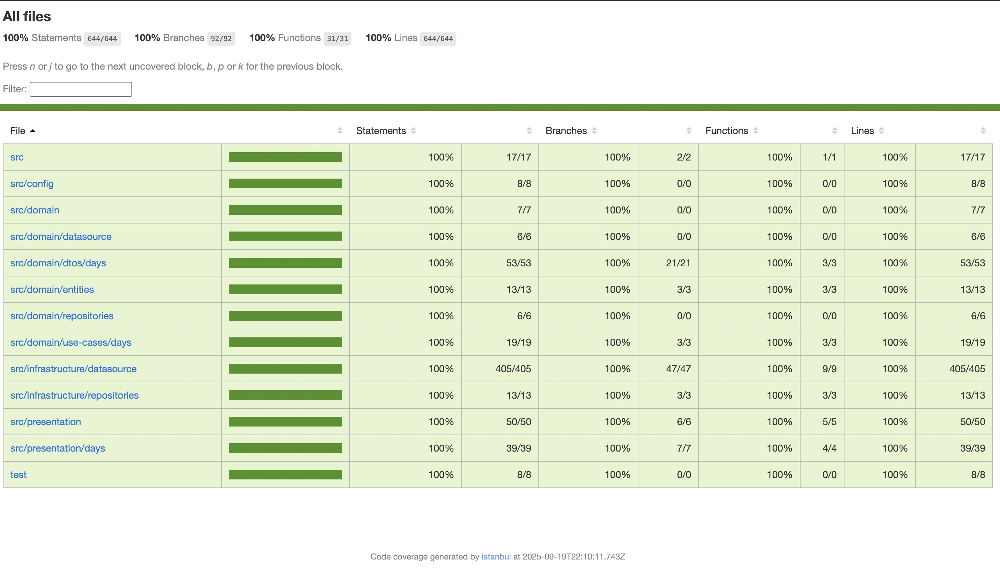
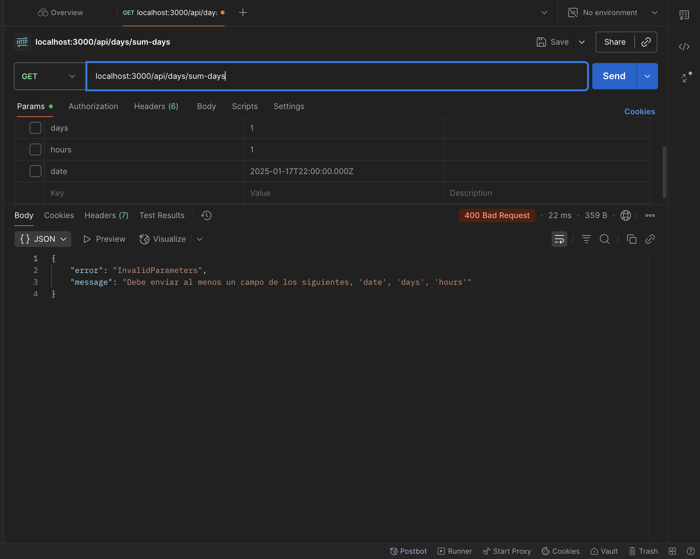
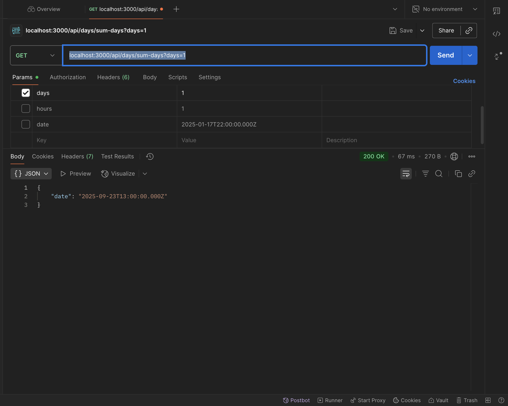

# Days Api

## modo desarrollo local

1. clonar el .env.template y renombrarlo a .env
2. ejecutar `npm install` en la consolja
3. ejecutar `npm run dev`
4. para generar el dist `npm run build` y luego ejecutar `npm run start` si se quiere mirar en preview

### con docker
1. ejecutat `docker compose up --build`
2. si quiere poner el contenedor de docker con hotreload cambiar la varibale de entorno `STAGIN` con `dev` y descomentar el codigo del `docker-compose.override.yml`

## test

1. para correr un simple test `npm run test`
2. para tener los test en modo observador `npm run test:watch`
3. para generar el reporte de covertura `npm run test:coverage`

### test coverage

## uso de la api

1. el endpoint seria `localhost:3000/api/days/sum-days`
2. recorder que se debe enviar un query param o si no la api respondera con un error

3. entonces se debe mandar al menos un query param como por ejemplo: `localhost:3000/api/days/sum-days?days=1`
